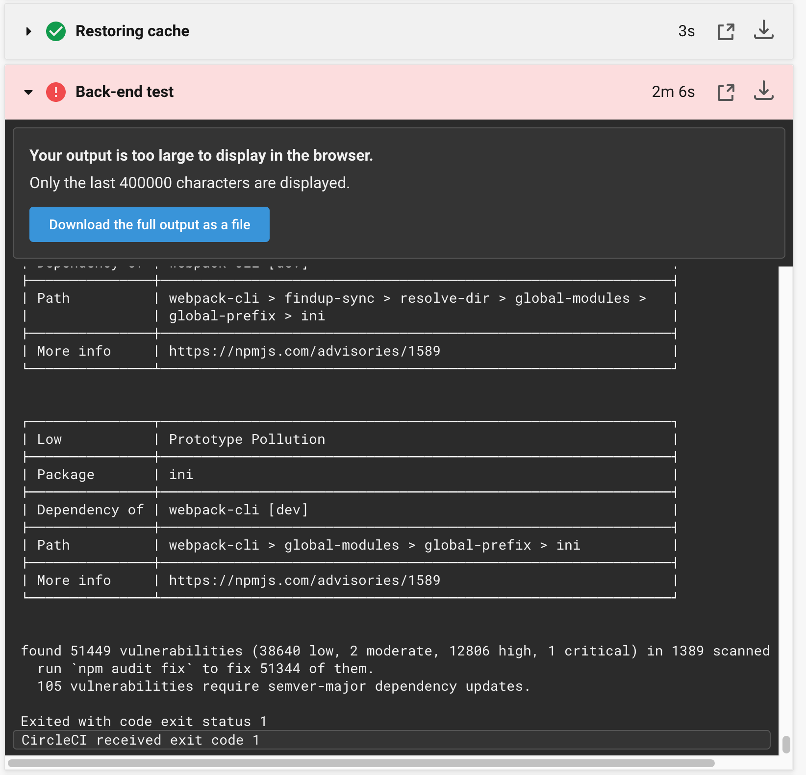
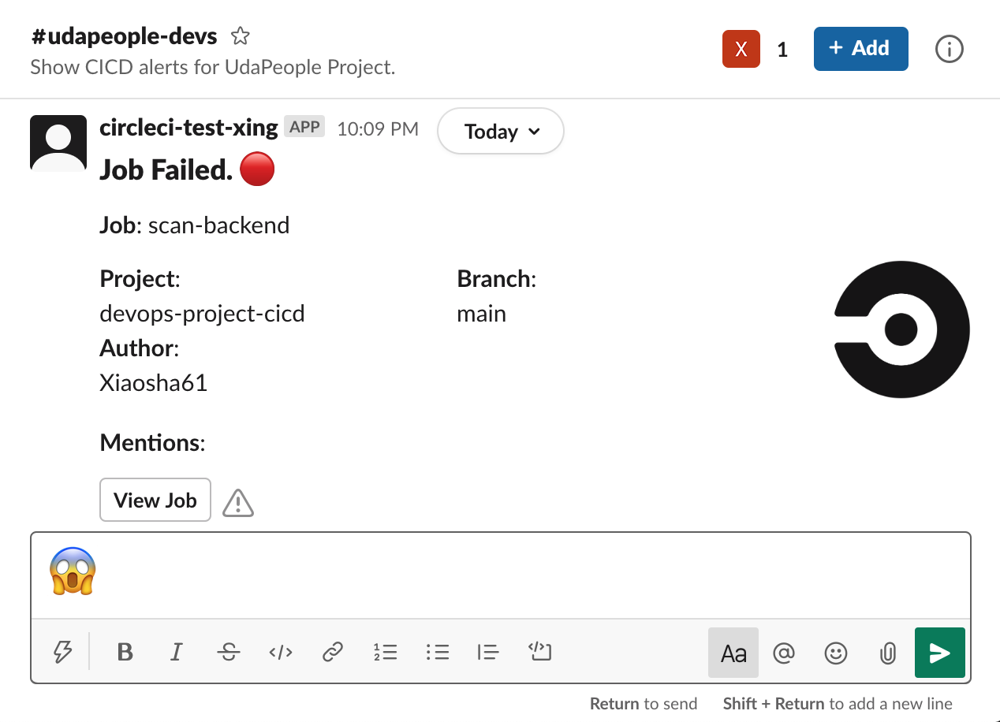
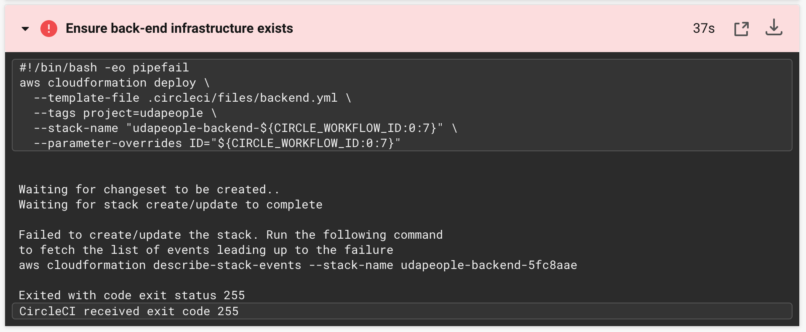
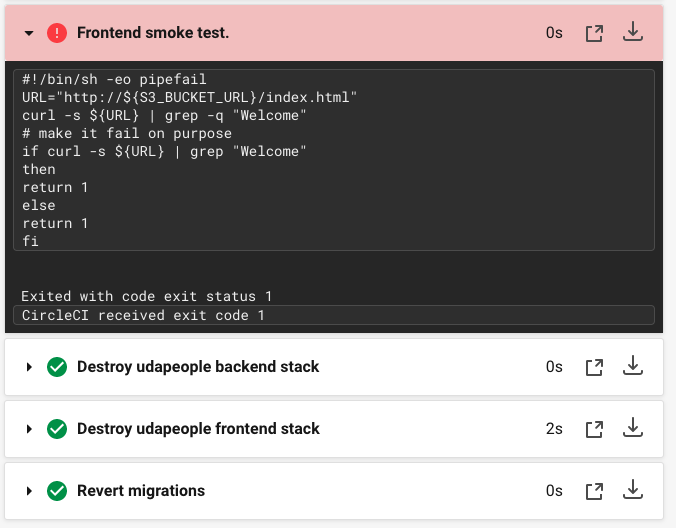
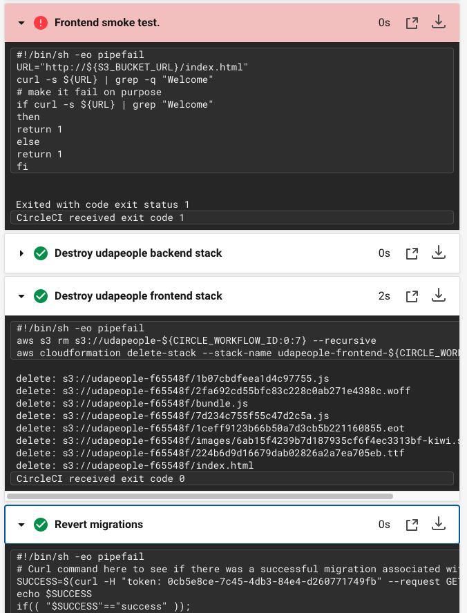
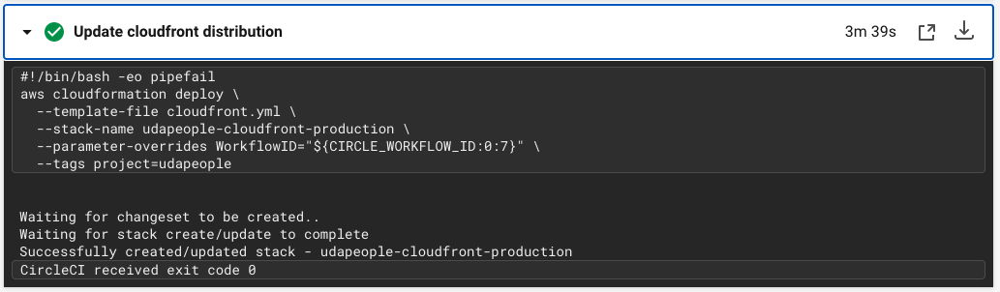
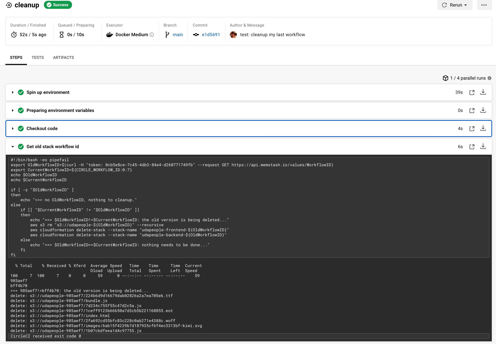
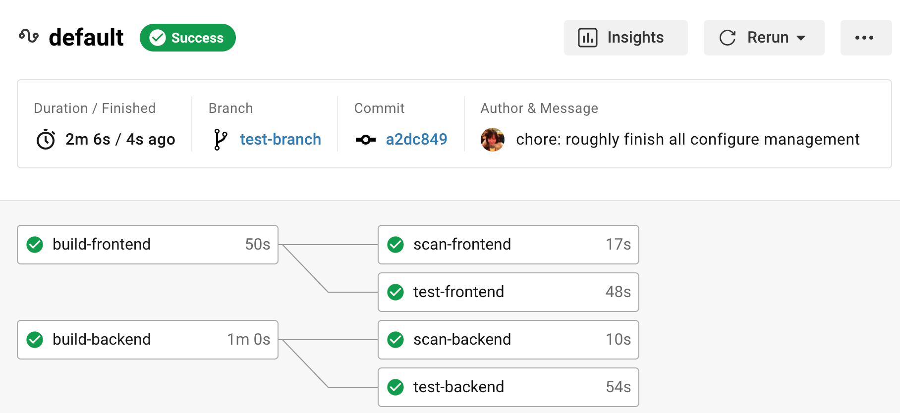
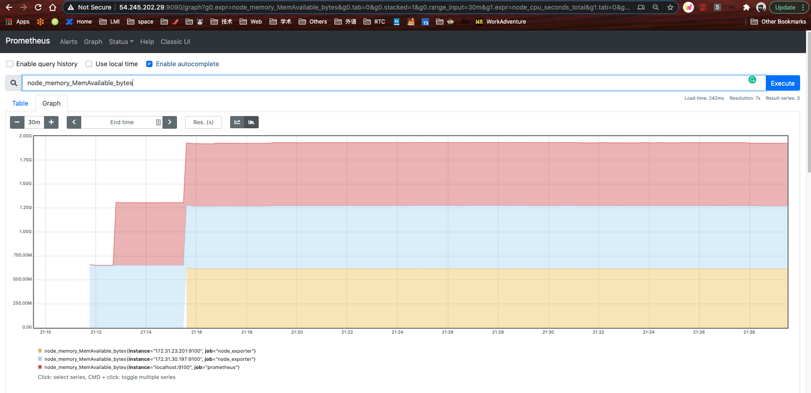
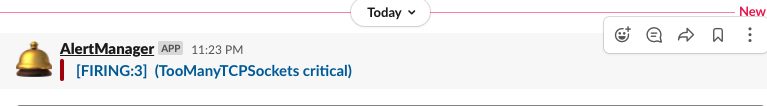

# Introduction
The purpose of this project is specified in [Project Introduction](./ProjectIntroduction.md).

# Project Submission Items
## Presentation
See [presentation.pdf](./presentation.pdf) in the project root folder.

## Urls
- Public Url to GitHub repository (not private) [URL01]
  - https://github.com/Xiaosha61/devops-project-cicd

- Public URL for your S3 Bucket (aka, your green candidate front-end) [URL02]
  - https://udapeople-bff4b70.s3-us-west-2.amazonaws.com/index.html

- Public URL for your CloudFront distribution (aka, your blue production front-end) [URL03]
  - d1k1q3ebynw1r6.cloudfront.net

- Public URLs to deployed application back-end in EC2 [URL04]
  - ec2-54-190-47-159.us-west-2.compute.amazonaws.com
  - http://ec2-54-190-47-159.us-west-2.compute.amazonaws.com:9100/metrics

- Public URL to your Prometheus Server [URL05]
  - http://ec2-54-245-202-29.us-west-2.compute.amazonaws.com:9090
  - http://ec2-54-245-202-29.us-west-2.compute.amazonaws.com:9090/graph?g0.expr=go_memstats_gc_cpu_fraction&g0.tab=0&g0.stacked=0&g0.range_input=12h&g1.expr=go_memstats_alloc_bytes&g1.tab=0&g1.stacked=0&g1.range_input=1h&g2.expr=node_disk_io_now&g2.tab=0&g2.stacked=0&g2.range_input=1h

## Screenshots
1. back-end build failed: 
2. back-end test failed: 
3. back-end scan failed: 
4. slack notification: 
5. deploy-infrastructure failed
   1. using non-existing ssh key: 
   <!-- 2. invalid resource type (not sure if it has to be exactly the same reason to fail as shown in the example...):  -->
6. Appropriate job failure for the smoke test job. 
7. Successful rollback after a failed smoke test. 
8. Successful promotion job. 
9.  Successful cleanup job 
10. Only deploy on pushed to `main` branch: 
11. a graph of your EC2 instance including available memory, available disk space, and CPU usage. 
    1. The screenshot is not big enough, there is a pdf file in screenshots folder named [SCREENSHOT11.pdf](screenshots/SCREENSHOT11.pdf)
12. an alert that was sent by Prometheus: 

