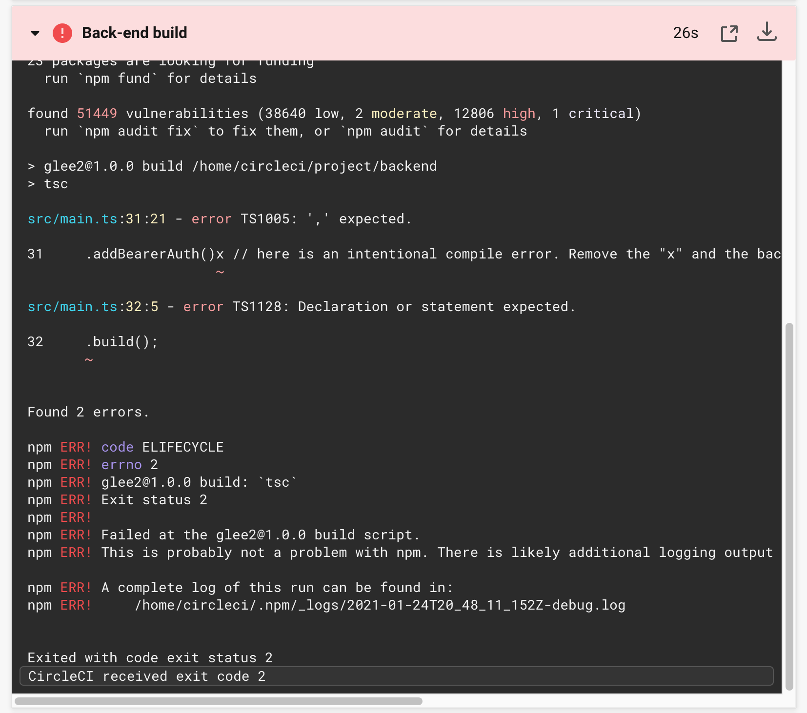
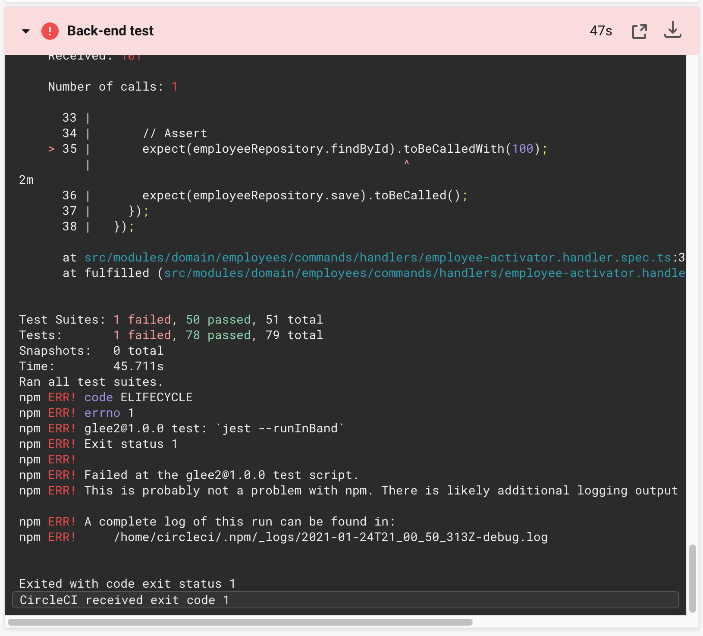

# Introduction
The purpose of this project is specified in [ProjectIntroduction](./ProjectIntroduction.md).

# Project Evaluation Items
## Screenshots
1. back-end build failed: 
2. back-end test failed: 
## Urls

# Build Steps

# Random Notes

## Connect CircleCI to Slack
Get instructions at: CircleCI Project Settings -> Slack Integration.
1. Setup Authentication: https://github.com/CircleCI-Public/slack-orb/wiki/Setup
   - SLACK_ACCESS_TOKEN: The OAuth token acquired through the previous steps.
   - SLACK_DEFAULT_CHANNEL: If no channel ID is specified, the Slack orb will attempt to post here.
2. Integrate Slack orb: https://circleci.com/developer/orbs/orb/circleci/slack

